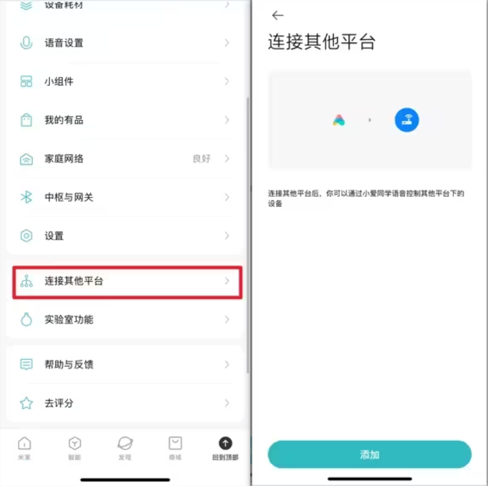
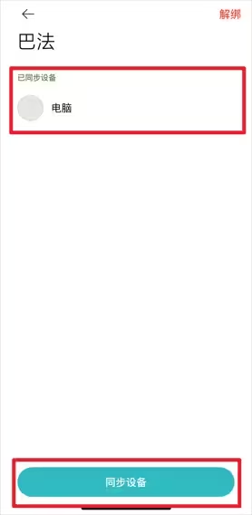

# 利用小爱同学控制局域网电脑开关机（docker/iStoreOS）

---

该分支用于c重新构建，缩小镜像体积

### 一、使用docker

---

#### （一）远程拉取（推荐）
##### 1. 拉取镜像

- x86/arm64
  ```bash
  docker pull yexundao/wakeup_pc:latest
  ```

  - 使用`Publish Docker image`手动构建或直接打上tags自动构建
  - x86和arm64都可以使用，默认推荐镜像。
  
- arm64
  ```bash
  docker pull yexundao/wakeup_pc:latest-arm
  ```

  - 使用`Publish Docker image by self-hosted runner`手动构建下才使用这种镜像。
  - 这种方式需要配置好自己的arm服务器的自建runner，连接仓库后arm版本在本地构建。
  - 自建runner安装方式参考 https://github.com/PlanetEditorX/wakeup_pc/settings/actions/runners/new 和 [在ARMbian系统上将自托管运行器注册为系统服务并使其在后台运行](attachment/在ARMbian系统上将自托管运行器注册为系统服务并使其在后台运行.md)
  - 不管哪种方式x86都可以使用，区别是使用`by self-hosted runner`方式将arm版本给区别出来，arm只能使用`latest-arm`镜像。
  
- 默认镜像latest为C编译好的，1.8.0即之后的版本都是C编译版本。
- 镜像体积缩小到十几兆，完全符合日常轻度使用。


##### 2. 创建配置文件
（1）在指定位置创建config.ini文件，如：`/vol1/1000/docker/wakeup/config.ini`

（2）按照配置文件说明进行相应的配置，可在仓库查找模板或直接保存 https://raw.githubusercontent.com/PlanetEditorX/wakeup_pc/refs/heads/main/docker/config.ini ，配置详情查看”使用iStoreOS“→“修改配置文件”。

##### 3. 运行镜像

- 带日志和配置命令启动

  - 在宿主机上配置文件目录下提前建立日志文件
    ```bash
    touch /vol1/1000/docker/wakeup/log.txt
    ```

  - 创建并启动容器

    - x86/arm64
      ```bash
      docker run -d \
        --name wakeup_pc \
        -v /vol1/1000/docker/wakeup/config.ini:/app/config.ini \
        -v /vol1/1000/docker/wakeup/log.txt:/app/log.txt \
        --restart always \
        --network host \
        yexundao/wakeup_pc:latest
      ```
    
    - arm64
      ```bash
      docker run -d \
        --name wakeup_pc \
        -v /root/soft/wakeup/config.ini:/app/config.ini \
        -v /root/soft/wakeup/log.txt:/app/log.txt \
        --restart always \
        --network host \
        yexundao/wakeup_pc:latest
      ```
      
      或自建runner版本
      
      ```bash
      docker run -d \
        --name wakeup_pc \
        -v /root/soft/wakeup/config.ini:/app/config.ini \
        -v /root/soft/wakeup/log.txt:/app/log.txt \
        --restart always \
        --network host \
        yexundao/wakeup_pc:latest-arm
      ```

- 仅配置命令
  ```bash
  docker run -d \
    --name wakeup_pc \
    -v /vol1/1000/docker/wakeup/config.ini:/app/config.ini \
    --restart always \
    --network host \
    yexundao/wakeup_pc:latest
  ```

- 需要先根据自己的具体信息配置好config.ini文件

- 将运行命令中`/vol1/1000/docker/wakeup/config.ini`修改为自己实际配置文件地址

- 注意，这里容器里的目录位置是/app/

- 如果需要查看输出日志，可进入容器排查
  ```bash
  docker exec -it wakeup_pc sh
  ```

  <div style="text-align: left;">
      
  </div>

- 如果是带日志的命令启动，可直接在docker的宿主机查看日志
  ```bash
  tail -f /vol1/1000/docker/wakeup/log.txt
  ```

  <div style="text-align: left;">
      
  </div>

- 如果是空日志文件，则第一行输出关机命令的参数，如`cmd_shutdown: sshpass -p 密码 ssh -A -g -o StrictHostKeyChecking=no 用户名@IP 'shutdown /s /t 10'`，可通过对比相关数据和config.ini的参数是否匹配，如果为空则说明参数读取异常，检查config.ini配置文件的内容和位置是否正确。

- 和巴法云建立TCP连接
  ```shell
  The IP address of bemfa.com is: 119.91.109.180
  Heartbeat sent
  recv: cmd=1&res=1
  ```

  会向巴法云的IP发送TCP请求，看返回的是否是`recv: cmd=1&res=1`，全是1才是订阅主题成功，其它情况检查是否参数异常。


---

#### （二）本地构建

##### 1.环境

- 由于是在Linux上进行的开发，所以wakeup.c文件的部分头文件会报错，如果是WIN进行编译修改可能需要转为Windows的替代头文件

##### 2. 创建 Dockerfile
- 创建一个Dockerfile来构建alpine 容器，并在其中设置脚本。
```Dockerfile
# 使用alpine作为基础镜像，并安装必要的编译工具和库
FROM alpine:3.18.6 as builder

# 安装musl-dev和libc-dev，它们包含了C标准库的头文件和静态库
RUN apk add --no-cache musl-dev libc-dev gcc

# 设置工作目录
WORKDIR /app

# 复制源代码和配置文件到工作目录
COPY wakeup.c config.ini /app/

# 静态编译C程序，确保使用静态链接
RUN gcc -static -o wakeup wakeup.c

# 使用alpine作为最终的基础镜像
FROM alpine:3.18.6

# 从构建阶段复制静态编译的可执行文件到最终镜像
COPY --from=builder /app/wakeup /app/
COPY start.sh config.ini crontab /app/
# 设置工作目录
WORKDIR /app
RUN apk add --no-cache sshpass openssh && \
    chmod +x ./start.sh

# 设置容器启动时执行的命令
CMD ["./start.sh"]
```
##### 3. 构建 Docker 镜像
- 使用以下命令构建 Docker 镜像，该命令将会创建一个名为wakeup_pc的本地镜像：
```bash
docker build -t wakeup_pc .
```
```bash
docker images
```


- 如果多次构建，会产生很多标签为`none`的镜像，使用命令`docker rmi $(docker images -f "dangling=true" -q)`删除无用镜像。

##### 4. 创建配置文件
- 从仓库https://github.com/PlanetEditorX/wakeup_pc/tree/main/docker 中获取并保存在Linux主机上
    
- config.ini详情见远程拉取和iStoreOS的配置文件相关说明
##### 5. 运行 Docker 容器
```bash
docker run -d --restart=unless-stopped --name wakeup_pc --network host wakeup_pc
```
###### 命令解释
- -d：参数，表示在后台运行容器。
- --restart=unless-stopped：参数，设置容器的重启策略。unless-stopped 意味着容器将自动重启除非它被明确停止（例如，通过 docker stop）或者 Docker 本身被停止。
- --name wakeup_pc：参数，为容器指定一个名称，这里是 wakeup_pc。
- --network host：参数，将容器的网络设置为 host 模式，这意味着容器将不会获得自己的网络接口，而是使用宿主机的网络接口，这样才能访问局域网的主机进行开机和关机操作。
##### 5. 进入容器进行数据查看和排查故障
```bash
docker exec -it wakeup_pc sh
```

---
#### （三）修改配置文件
##### 1. <span class='custom-title-span'>按照说明逐一修改配置文件</span>
##### 2. 巴法云私钥/client_id
- 
##### 3. 主题值/topic
- 
##### 4. 设备MAC地址/mac
（1）需要唤醒的设备输入：`ipconfig /all`，找到支持唤醒的网卡的物理地址，注意：如果显示的物理地址为XX-XX-XX-XX-XX-XX，需要将短横杠替换为冒号，XX:XX:XX:XX:XX:XX


##### 5. 远程电脑IP地址/ip
（1）需要唤醒的设备输入：`ipconfig`，根据自己的网卡找到IP地址
 

##### 6. 远程SSH用户账号/user
- 设置的用户名
##### 7. 远程SSH用户密码/password
- 设置的用户密码

---

### 二、SSH服务器配置

---
#### （一）启用OpenSSH
1. 设置—系统—可选功能—添加功能—OpenSSH服务器
2. 不成功参考 https://learn.microsoft.com/en-us/windows-server/administration/openssh/openssh_install_firstuse?tabs=powershell 或网上查找其它解决办法
 

---
#### （二）创建用户
##### 1. <span class='custom-title-span'>可以直接当前的本地用户，但由于密码是明文传输，为了增加一点点安全性，创建一个用于ssh登录的账户。</span>
##### 2. 打开编辑本地用户和组：win+r，输入lusrmgr.msc
-  
##### 3. <span class='custom-title-span'>输入用户名和密码，此处的用户名和密码就是SSH的用户名和密码，添加到配置的user和password</span>
##### 4. <span class='custom-title-span'>取消用户下次登录时须更改密码（M）的勾选，勾选用户不能更改密码(S)和密码永不过期(W)</span>

---
#### （三）测试用户
> 1. 打开powershell
> 2. 输入ssh 用户名@IP
> 3. 初次会提示输入yes
> 4. 输入隐形密码
> 5. 前方由文件地址转为用户名@主机名表示成功

---
#### （四）隐藏用户
##### 1. <span class='custom-title-span'>避免多用户时会在登录页面显示不需要的用户，参考https://www.ithome.com/0/228/192.htm</span>
##### 2. 确认要隐藏账户全名
（1）在开始按钮单击右键，选择“计算机管理”

（2）进入系统工具→本地用户和组→用户，在中间找到目标用户账户名

（3）记录好账户全名（本地账户没有“全名”，记录好“名称”即可）

##### 3. 新建注册表特殊账户
（1）`win+r`输入`regedit`后回车进入注册表编辑器

（2）定位到`HKEY_LOCAL_MACHINE\SOFTWARE\Microsoft\Windows NT\CurrentVersion\Winlogon`

（3）在`Winlogon`单击右键新建“项”，命名为`SpecialAccounts`

（4）在`SpecialAccounts`单击右键新建“项”，命名为`UserList`

（5）在`UserList`单击右键`新建DWORD（32位）值`（如上图），命名为第一步中记录的账户全名（或本地账户名称），数值数据保持默认的0，此时进入锁屏，隐藏用户不可见。


---

#### （五）权限限制（可选）
##### 1. <span class='custom-title-span'>适当的限制权限，避免别人获取这个账号后用这个账号使用电脑，参考[https://www.ithome.com/0/228/192.htm](https://post.smzdm.com/p/akxwkxqk/)</span>
##### 2. 按教程走，主要就是 `限制此用户登录到系统上：“拒绝本地登录”和“拒绝通过远程桌面服务登录”`，避免有意或无意中登录电脑，在电脑中留下无用的用户文件，其它安全配置看情况，一般局域网用户也用不着过于严密

### 三、巴法云

---

#### （一）注册巴法云账号

> - https://cloud.bemfa.com/


---

#### （二）创建主题

 

> 1. 主题名字必须为XX001，以001结尾的代表是一个插座设备，后续连接小爱音箱后，对它说打开关闭，巴法云上就会收到on/off的数据，才能进行后续操作。
> 2. 点击昵称就可以修改该主题的名字，这里直接改为电脑。


---

#### （三）添加到小爱同学

##### 1. 在米家app的“我的”菜单项中选择连接其它平台

 


##### 2. 找到并添加巴法

 


##### 3. 可以看到有在网页上命名的电脑设备，点击同步设备

 

---

### 四、docker和iStoreOS对比

---

#### （一）docker

##### 优势

- 已有docker环境下配置快速，简单
- 不受限于设备环境，几乎任何设备都是一样的操作

##### 劣势

- 占用空间较大（100MB左右）
- 需要提前配置好docker网络环境，需要一点点docker相关的知识或能根据故障自己进行搜索排查


---

#### （二）iStoreOS

##### 优势

- 软件利用率高，本身系统安装的软件包在其它程序也可以使用
- 新增占用空间较小，安装受网络环境影响小

##### 劣势

- 配置较慢，较繁琐
- 可能存在使用不同Openwrt版本而出现有人配置成功，有人配置不成功或并不知道自己哪里出错的情况
- 可能会出现用着用着突然无法使用的情况，重启也没用，软件包重装又正常.......

---

### 五、更新docker镜像

---

#### （一）创建工作流

##### 触发

```dockerfile
on:
  push:
    tags:
      - "v*"
```
- 打上`V*`标签并推送自动触发操作
  ```bash
  git tag -a v2.0.0 -m "Release version 2.0.0"
  git push --tags
  ```
  - 根据需要修改`v2.0.0`→`va.b.c`和之后的描述
  - `v2.0.0`/`va.b.c`在工作流中将会提取`v2.0.0`/`a.b.c`作为标签打在镜像上，镜像上将会同时有两个tags：`v2.0.0`/`a.b.c`和`latest`

##### 标签的获取
```dockerfile
- name: Extract metadata (tags, labels) for Docker
  id: meta
  uses: docker/metadata-action@9ec57ed1fcdbf14dcef7dfbe97b2010124a938b7
  with:
    images: 用户名/镜像名字
    tags: |
          type=semver,pattern={{version}}
          type=raw,value=latest
```
- 根据实际参数修改对应的名字，可直接在Docker Hub的镜像发布页查看

##### Docker Hub的登录
```dockerfile
- name: Log in to Docker Hub
  uses: docker/login-action@f4ef78c080cd8ba55a85445d5b36e214a81df20a
  with:
    username: ${{ secrets.DOCKER_USERNAME }}
    password: ${{ secrets.DOCKER_PASSWORD }}
```
- 账号配置
  - Settings→Security→Secrets and variables→Actions→Repository secrets→New repository secret
  - `Name`为参数名，`Secret`为具体的值
  - 用户名参数为：`Name`：`DOCKER_USERNAME`，`Secret`：`Docker Hub的用户名`
  - 密码参数为：`Name`：`DOCKER_PASSWORD`，`Secret`：`Docker Hub的密码`

##### 运行目录的配置
```dockerfile
- name: Build and push Docker image
  id: push
  uses: docker/build-push-action@3b5e8027fcad23fda98b2e3ac259d8d67585f671
  with:
    context: ./docker
    file: ./docker/Dockerfile
    push: true
    tags: ${{ steps.meta.outputs.tags }}
    labels: ${{ steps.meta.outputs.labels }}
```
- 修改运行目录，由于Dockerfile文件是存在于仓库的`/docker/Dockerfile`位置，需要同时修改`context`和`file`为对应的路径

---

### 七、故障排除（更新...）

---

#### （一）iStoreOS的启动项无法启动

- 排查故障
  - 将启动项和计划任务的命令单独放在终端中，查看是否正常启动，是否有报错，再重启尝试。

#### （二）iStoreOS可以唤醒电脑无法关闭电脑
- 排查故障
  - 查看wakeup.py同级目录下是否有log.txt日志生成，查看日志内容排除故障
- 可能原因
  - 如果日志显示：Host '主机IP' is not in the trusted hosts file. 则需要进入iStoreOS终端，在目标PC开机的状态下进行一次ssh连接，连接后自动添加为可信。
    - 如果还是不行，查看是否是类似于(ssh-ed25519 fingerprint SHA256:XbhC....)的提示，去网页，卸载掉ssh相关的软件包，重新安装openssh-client sshpass

#### （三）docker无法唤醒电脑
- 可能原因
  - 进入容器内部，手动执行唤醒代码，如失败则说明可能是docker的网络环境出问题，无法访问到局域网设备，检查并重新设置docker网络配置。

#### （四）docker无法关闭电脑

- 可能原因
  - 可查看日志的第一行，如`cmd_shutdown: sshpass -p 密码 ssh -A -g -o StrictHostKeyChecking=no 用户名@IP 'shutdown /s /t 10'`在容器内手动执行` sshpass -p 密码 ssh -A -g -o StrictHostKeyChecking=no 用户名@IP 'shutdown /s /t 10'`查看是否能够执行成功关闭电脑，可能是网络环境的问题，也可能是Windows的SSH配置问题。
