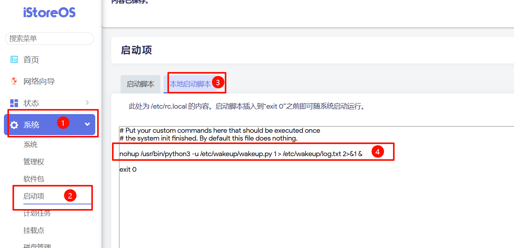

# 利用小爱同学唤醒局域网PC（docker/iStoreOS）
<hr style='border-top-style: dotted !important;'>

### 一、使用docker

---
#### （一）本地构建
##### 1. 创建 Dockerfile
- 创建一个Dockerfile来构建alpine 容器，并在其中设置你的 Python 脚本。
```Dockerfile
FROM alpine:latest

#安装必要依赖
RUN echo "https://dl-cdn.alpinelinux.org/alpine/edge/testing" >> /etc/apk/repositories
RUN apk update
RUN apk add --no-cache python3 curl openssh wakeonlan cronie sshpass

# 将脚本复制到容器中
COPY wakeup.py /wakeup.py
# 使脚本可执行
RUN chmod +x /wakeup.py

# 复制配置文件
COPY config.ini /config.ini

# cron定时任务
ADD crontab /crontab
RUN /usr/bin/crontab /crontab

# 将 start.sh 脚本复制到容器中
COPY start.sh /start.sh

# 使脚本可执行
RUN chmod +x /start.sh

# 清理缓存
RUN apk cache clean

# 使用 start.sh 作为 CMD 指令
CMD ["/start.sh"]
```
##### 2. 构建 Docker 镜像
- 使用以下命令构建 Docker 镜像，该命令将会创建一个名为wakeup_pc的本地镜像：
```bash
docker build -t wakeup_pc .
```
```bash
docker images
```
  

##### 3. 创建配置文件
- 从仓库https://github.com/PlanetEditorX/wakeup_pc/tree/main/docker 中获取并保存在Linux主机上
    
- config.ini见远程拉取的配置文件说明
##### 4. 运行 Docker 容器
```bash
docker run -d --restart=unless-stopped --name wakeup_pc --network host wakeup_pc
```
###### 命令解释
- -d：参数，表示在后台运行容器。
- --restart=unless-stopped：参数，设置容器的重启策略。unless-stopped 意味着容器将自动重启除非它被明确停止（例如，通过 docker stop）或者 Docker 本身被停止。
- --name wakeup_pc：参数，为容器指定一个名称，这里是 wakeup_pc。
- --network host：参数，将容器的网络设置为 host 模式，这意味着容器将不会获得自己的网络接口，而是使用宿主机的网络接口，这样才能访问局域网的主机进行开机和关机操作。
##### 5. 进入容器
```bash
docker exec -it wakeup_pc sh
```

---
#### （二）远程拉取
##### 1. 拉取镜像
```bash
docker pull yexundao/wakeup_pc:latest
```
##### 2. 创建配置文件
（1）在指定位置创建config.ini文件，如：`/vol1/1000/docker/wakeup/config.ini`

（2）按照配置文件说明进行相应的配置，可在仓库查找模板或直接保存https://raw.githubusercontent.com/PlanetEditorX/wakeup_pc/refs/heads/main/docker/config.ini ，配置详情查看”使用iStoreOS“→“修改配置文件”。

##### 3. 运行镜像
```bash
docker run -d --restart=unless-stopped --name wakeup_pc --network host -v /vol1/1000/docker/wakeup/config.ini:/config.ini yexundao/wakeup_pc:latest
```

- 需要先根据自己的具体信息配置好config.ini文件
- 将运行命令中`/vol1/1000/docker/wakeup/config.ini`修改为自己实际地址


<hr style='border-top-style: dotted !important;'>


### 二、使用iStoreOS

---
#### （一）创建文件夹
> - 在任意位置创建文件夹，如：mkdir /etc/wakeup

---
#### （二）上传配置文件
- 从仓库中下载并上传config.ini和wakeup.py
  

---
#### （三）修改配置文件
##### 1. <span class='custom-title-span'>按照说明逐一修改配置文件</span>
##### 2. 巴法云私钥/client_id
- 
##### 3. 主题值/topic
- 
##### 4. 设备MAC地址/mac
（1）需要唤醒的设备输入：ipconfig /all，找到支持唤醒的网卡的物理地址，注意：如果显示的物理地址为XX-XX-XX-XX-XX-XX，需要将短横杠替换为冒号，XX:XX:XX:XX:XX:XX


##### 5. 远程电脑IP地址/ip
（1）需要唤醒的设备输入：ipconfig，根据自己的网卡找到IP地址
 

##### 6. 远程SSH用户账号/user
- 设置的用户名
##### 7. 远程SSH用户密码/password
- 设置的用户密码

---
#### （四）安装依赖
```bash
opkg update
opkg install wakeonlan python3 sshpass
```

---
#### （五）开机启动
- 在系统-启动项-本地启动脚本中添加代码，让其开机启动
```bash
nohup /usr/bin/python3 -u /etc/wakeup/wakeup.py 1 > /etc/wakeup/log.txt 2>&1 &
```
 

---
#### （六）计划任务
- 在系统-计划任务中添加任务，作用是每个小时，会kill掉wakeup.py的后台进程，并重新启动一个新的进程，防止长时间掉线。
```bash
0 */1 * * * ps | grep wakeup.py | grep -v grep | awk '{print $1}' | xargs kill -9; nohup /usr/bin/python3 -u /etc/wakeup/wakeup.py 1 > /etc/wakeup/log.txt 2>&1 &
```
 

---
#### （七）生效操作
- 重启或来到系统-启动项-启动脚本，ctrl+f 搜索 cron，并点击重启，使计划任务生效

<hr style='border-top-style: dotted !important;'>

### 三、SSH服务器配置

---
#### （一）启用OpenSSH
1. 设置—系统—可选功能—添加功能—OpenSSH服务器
2. 不成功参考 https://learn.microsoft.com/en-us/windows-server/administration/openssh/openssh_install_firstuse?tabs=powershell或网上查找其它解决办法
 

---
#### （二）创建用户
##### 1. <span class='custom-title-span'>可以直接当前的本地用户，但由于密码是明文传输，为了增加一点点安全性，创建一个用于ssh登录的账户。</span>
##### 2. 打开编辑本地用户和组：win+r，输入lusrmgr.msc
-  
##### 3. <span class='custom-title-span'>输入用户名和密码，此处的用户名和密码就是SSH的用户名和密码，添加到配置的user和password</span>
##### 4. <span class='custom-title-span'>取消用户下次登录时须更改密码（M）的勾选</span>

---
#### （三）测试用户
> 1. 打开powershell
> 2. 输入ssh 用户名@IP
> 3. 初次会提示输入yes
> 4. 输入隐形密码
> 5. 前方由文件地址转为用户名@主机名表示成功

---
#### （四）隐藏用户
##### 1. <span class='custom-title-span'>避免多用户时会在登录页面显示不需要的用户，参考https://www.ithome.com/0/228/192.htm</span>
##### 2. 确认要隐藏账户全名
（1）在开始按钮单击右键，选择“计算机管理”
（2）进入系统工具→本地用户和组→用户，在中间找到目标用户账户名
（3）记录好账户全名（本地账户没有“全名”，记录好“名称”即可）
##### 3. 新建注册表特殊账户
（1）win+r输入regedit后回车进入注册表编辑器
（2）定位到`HKEY_LOCAL_MACHINE\SOFTWARE\Microsoft\Windows NT\CurrentVersion\Winlogon`
（3）在Winlogon单击右键新建“项”，命名为SpecialAccounts
（4）在SpecialAccounts单击右键新建“项”，命名为UserList
（5）在UserList单击右键新建DWORD（32位）值（如上图），命名为第一步中记录的账户全名（或本地账户名称），数值数据保持默认的0，此时进入锁屏，隐藏用户不可见。


<hr style='border-top-style: dotted !important;'>

### 四、巴法云

---

#### （一）注册巴法云账号

> - https://cloud.bemfa.com/


---

#### （二）创建主题

 

> 1. 主题名字必须为XX001，以001结尾的代表是一个插座设备，后续连接小爱音箱后，对它说打开关闭，巴法云上就会收到on/off的数据，才能进行后续操作。
> 2. 点击昵称就可以修改该主题的名字，这里直接改为电脑。


---

#### （三）添加到小爱同学

##### 1. 在米家app的“我的”菜单项中选择连接其它平台

 


##### 2. 找到并添加巴法

 


##### 3. 可以看到有在网页上命名的电脑设备，点击同步设备

 

<hr style='border-top-style: dotted !important;'>

### 五、docker和iStoreOS对比

---

#### （一）docker

##### 优势

- 配置较快，简单
- 不受限于设备环境，几乎任何设备都是一样的操作

##### 劣势

- 占用空间较大（100MB左右）
- 需要提前配置好docker网络环境


---

#### （二）iStoreOS

##### 优势

- 软件利用率高，本身系统安装的软件包在其它程序也可以使用
- 占用空间较小，安装快速

##### 劣势

- 配置较慢，较繁琐
- 可能存在使用不同Openwrt版本而出现有人配置成功，有人配置不成功或并不知道自己哪里出错的情况
- 可能会出现用着用着突然无法使用的情况，重启也没用，软件包重装又正常.......

### 六、故障排除（更新...）

---

#### （一）iStoreOS的启动项无法启动

- 可能原因
  - 将启动项和计划任务的命令单独放在终端中，查看是否正常启动，是否有报错，再重启尝试。

#### （二）iStoreOS可以启动电脑无法关闭电脑
- 可能原因
  - 查看wakeup.py同级目录下是否有log.txt日志生成，查看日志内容排除故障
  - 如果日志显示：Host '主机IP' is not in the trusted hosts file. 则需要进入isos终端，在目标PC开机的状态下进行一次ssh连接，连接后自动添加为可信。
    - 如果还是不行，查看是否是类似于(ssh-ed25519 fingerprint SHA256:XbhC....)的提示，去网页，卸载掉ssh相关的软件包，重新安装openssh-client sshpass
